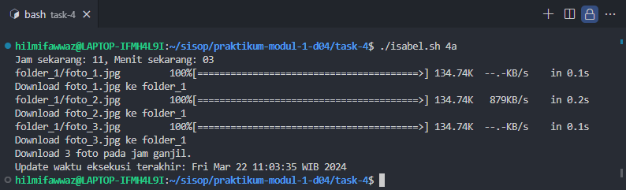
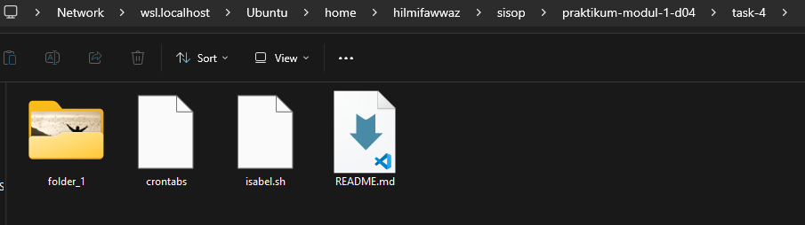
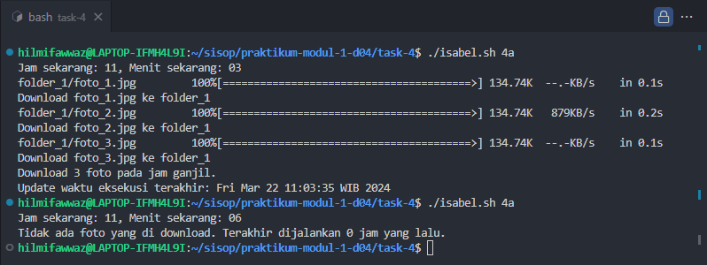

[](https://classroom.github.com/a/nyzv0V02)
<div align=center>

|    NRP     |      Name      |
| :--------: | :------------: |
| 5025221007 | Yehezkiella Felicia Jeis Timbulong |
| 5025221047 | Muhammad Rayyaan Fatikhahur Rakhim |
| 5025221103 | Hilmi Fawwaz Sa'ad |

# Praktikum Modul 1 _(Module 1 Lab Work)_

</div>

### Daftar Soal _(Task List)_

- [Task 1 - Tim Kawal Bubu _(Bubu's Monitoring Team)_](/task-1/)

- [Task 2 - Gabut Yuan _(Yuan's Boredom)_](/task-2/)

- [Task 3 - Magang Bubu _(Bubu's Internship)_](/task-3/)

- [Task 4 - LDR Isabel _(Isabel Sad Relationship)_](/task-4/)

### Laporan Resmi Praktikum Modul 1 _(Module 1 Lab Work Report)_

Tulis laporan resmi di sini!

_Write your lab work report here!_
## 1️⃣ Soal 1
Setelah masa upload proposal PKM 2024, Bubu sebagai sebagai anggota tim kawal melakukan scraping data upload dan mendapat file dalam format comma separated value (.csv). Bubu Pun mengirimkan file tersebut ke komandan PKM, namun komandan memiliki kesulitan untuk membaca data tersebut. Beliau mendelegasikan Bubu untuk menganalisis data tersebut. Karena kamu adalah Suhu dalam perlinux-an menurut Bubu maka ia spontan membuat challenge untukmu mengerjakan task tersebut seluruhnya menggunakan shell scripting.
### Problem 1a
Karena Belmawa menetapkan judul maksimum proposal 20 kata, maka komandan ingin mencari data siapa saja tim yang tidak memenuhi ketentuan ini. Tampilkan nama pengusul, beserta departemennya yang judulnya lebih dari 20 kata. Pisahkan spasi dan hapus underscore "_" pada nama pengusul.

**Jawab**

*1. Inisiasi awal, variabel file pkm dan separator \t*
```bash
#!/bin/bash
pkm_tsv_file="resources/DataPKM.tsv"
awk -F'\t' '
```
Detail :
- `pkm_tsv_file="resources/DataPKM.tsv"` 
inisiasi variabel pkm_tsv_file yang didapat dari resources/DataPKM.tsv
- `awk -F'\t' '` 
menggunakan separator \t untuk memberi tahu awk bahwa tab adalah pemisah

*2. Inisiasi awal, variabel maks_judul dan print no dan nama pengusul sebagai baris teratas*
```bash
BEGIN {
    maksimum_judul = 20
    print "No. Nama Pengusul"
}
```
Detail :
- `BEGIN` 
inisiasi variabel untuk menyimpan nilai dari judul maks
- `print "No. Nama Pengusul"` 
menamplkan tulisan No. dan Nama Pengusul pada baris paling atas untuk memperjelas isi data pada kolom

*3. Mengubah underscore menjadi spasi dan memisahkan setiap judul melalui spasi*
```bash
{
    gsub(/_/, " ", $2)
    split($5, judul, " ")
```
Detail :
- `gsub (/_/, " ", $2)` 
mengubah antara underscore menjadi spasi pada kolom kedua (kolom nama pengusul)
- `split($5, judul, " ")` 
memisahkan setiap spasi untuk dideteksi pada kolom judul (kolom judul)

*4. Menampilkan judul yang lebih dari 20 kata*
```bash
    if (length(judul) > maksimum_judul) {
        printf "%s\t%s\n", $1, $2
    }
}
' "$pkm_tsv_file"
```
Detail :
- `if (length(judul) > maksimum_judul)` 
mendeteksi apakah panjang dari judul yang displit tadi melebihi 20 atau tidak, jika iya tampilkan nomor (kolom 1) dan nama pengusul (kolom 2)
- `' "$pkm_tsv_file"` 
menjalankan script AWK dan memberikan file TSV yang akan diproses ke dalamnya.

### output
```bash
No. Nama Pengusul
40      MUHAMAD MUFLICH DHIYA`ULHAQ     S1 Teknik Material 
61      AHMAD RIZAL MAULANA     S1 Fisika 
123     Ratu Ummu Subarusari    S1 Biologi 
137     ERIK DWI PRASTIYO       D4 Teknologi Rekayasa Instrumentasi 
138     Irgi Israr Altamis      S1 Teknik Elektro 
168     I MADE RECO MANOHARA    S1 Teknik Material 
175     Farsya Ra`isah Fadhilia S1 Teknik Elektro 
216     KURNIAWAN HIDAYAT       D4 Teknik Sipil 
251     MONICA INTAN WIJAYANTI  D4 Teknologi Rekayasa Instrumentasi 
266     LAZUARDINI DINDA AAQILAH        S1 Perencanaan Wilayah Dan Kota 
370     AUDYA WYNONA RAYHANNAH JASMINE  D4 Teknologi Rekayasa Kimia Industri 
396     AMELIA ADERAY PERTIWI   S1 Perencanaan Wilayah Dan Kota 
415     Rivansyah Raditya Hardinata     S1 Teknik Elektro 
454     Bintang Averusiya Muhammad      S1 Teknik Elektro 
480     NUR FAJARIN DWITASARI   S1 Teknik Industri 
```
### Problem 1b
Komandan PKM juga tertarik ingin tahu antusiasme dan partisipasi mahasiswa sehingga meminta Bubu menampilkan bidang paling banyak diminati oleh mahasiswa. Tampilkan nama skema saja.

**Jawab**

*1. Inisiasi awal, variabel file pkm dan separator \t*
```bash
#!/bin/bash
pkm_tsv_file="resources/DataPKM.tsv"
awk -F'\t' '
```
Detail :
- `pkm_tsv_file="resources/DataPKM.tsv"` 
inisiasi variabel pkm_tsv_file yang didapat dari resources/DataPKM.tsv
- `awk -F'\t' '` 
menggunakan separator \t untuk memberi tahu awk bahwa tab adalah pemisah

*2. mencari skema yang sama pada kolom 7*
```bash
{
    if ($7 in schema) {
        schema[$7]++
    } else {
        schema[$7] = 1
    }
}
```
Detail :
- ` if ($7 in schema) {
        schema[$7]++}` 
jika ada skema yang sama maka increment
- `else {
        schema[$7] = 1
    }` 
jika tidak, isi dengan 1

*3. mencari nilai maks dari keseluruhan skema yang paling diminati*
```bash
END {
    pkm_paling_diminati = 0
    for (i in schema) {
        if (schema[i] > pkm_paling_diminati) {
            pkm_paling_diminati = schema[i]
            skema_pkm = i
        }
    }
    printf "Skema dengan peminat terbanyak adalah skema %s\n", skema_pkm
}
' "$pkm_tsv_file"
```
Detail :
- ` pkm_paling_diminati = 0` 
inisiasi variabel pkm paling diminati
- `for (i in schema) ` 
untuk semua i yang ada dalam skema (yang telah dihitung melalui increment)
- `if (schema[i] > pkm_paling_diminati) {
            pkm_paling_diminati = schema[i]
            skema_pkm = i
        }` 
jika skema pada index i lebih dari inisiasi awal (mencari nilai max), maka value direplace, kemudian setelah mendapatkan nilai max, print skema dengan peminat paling banyak

### output
```bash
Skema dengan peminat terbanyak adalah skema PKM-RE
```

### Problem 1c
arena ada aturan baru dimana 1 mahasiswa hanya boleh submit 1 proposal, maka komandan juga meminta Bubu untuk memberikan list mahasiswa yang mengajukan 2 proposal. Tampilkan data pembimbingnya karena ingin di kontak komandan.

**Jawab**

*1. Inisiasi awal, variabel file pkm dan separator \t*
```bash
#!/bin/bash

pkm_tsv_file="resources/DataPKM.tsv"
awk -F'\t' '
```

Detail :
- `pkm_tsv_file="resources/DataPKM.tsv"` 
inisiasi variabel pkm_tsv_file yang didapat dari resources/DataPKM.tsv
- `awk -F'\t' '` 
menggunakan separator \t untuk memberi tahu awk bahwa tab adalah pemisah

*2. Inisiasi variabel kosong*
```bash
BEGIN {
    mahasiswa = ""
    dosbing = ""
}
```
Detail :
- `BEGIN` 
bagian yang dijalankan sebelum AWK mulai membaca baris file, sehingga dibuat variabel kosong untuk mahasiswa dan dosbing yang diisi ketika read file tsv


*3. Inisiasi penempatan variabel dan kolom yang digunakan*
```bash
{
    nama_mhs = $2
    nama_dosbing = $6
    gsub(/_/, " ", nama_mhs)
```
Detail :
- `nama_mhs = $2
    nama_dosbing = $6` 
inisisasi nama_mhs dan nama_dosbing diambil pada kolom kedua dan keenam
Detail :
- `gsub(/_/, " ", nama_mhs)` 
fungsi gsub digunakan untuk mengganti underscore (_) menjadi spasi ( ) pada kolom nama_mhs

*4. hitung nama mahasiswa dan menambahkan nilai dosen pembimbing melalui index yang sesuai dengan nama_mhs*
```bash
    count[nama_mhs]++
    dosen_pembimbing[nama_mhs] = dosen_pembimbing[nama_mhs] nama_dosbing
}
```
Detail :
- ` count[nama_mhs]++` 
menghitung nama_mhs yang memiliki index/string yang sama
- `dosen_pembimbing[nama_mhs] = dosen_pembimbing[nama_mhs] nama_dosbing` 
menyimpan daftar dosen pembimbing untuk setiap mahasiswa dalam array dosen_pembimbing.

*5. fungsi untuk menampilkan nama mahasiswa yang lebih dari satu dan dosen pembimbingnya*
```bash
END {
    for (nama_mhs in count) {
        if (count[nama_mhs] > 1) {
                printf "nama yang lebih dari 1 adalah %s dengan dosbing %s\n", nama_mhs, dosen_pembimbing[nama_mhs]
        }
    }
}
' "$pkm_tsv_file"
```
Detail :
- `END` 
mendapatkan nilai keseluruhan index mhs yang double kemudian di looping sesuai dengan jumlah count. Jika terhitung lebih dari 1 maka akan menampilkan nama mhs dan nama dosen pembimbing yang bersangkutan
Detail :
- `' "$pkm_tsv_file"` 
menjalankan script AWK dan memberikan file TSV yang akan diproses ke dalamnya.

### output
```bash
nama yang lebih dari 1 adalah Hanan Aldi dengan dosbing NURUL WIDIASTUTI (0025047104) HAMDAN DWI RIZQI (0701099201)
```

### Kendala

## 2️⃣ Soal 2
Yuan sedang gabut dan lagi makan toge. Setelah kenyang, dia ingin menambah suatu kerjaan baru. Dia sebagai panitia KSN ingin membuat suatu website yang handle login dan register untuk proposal PKM. File yang digunakan sama seperti di nomor 1
### Problem 2a
* Yuan ingin membuat file bash login bernama yu_login.sh untuk memastikan bahwa peserta yang telah ada di dalam file .csv tersebut, dapat langsung melakukan login, tanpa perlu register. Apabila loginnya sukses, maka akan masuk ke log.txt
* Memasukkan username. Username didapatkan dari kata pertama pada kolom nama_pengusul

**Jawab**
*
#!/bin/bash

pkm_csv_file="resources/data-pkm.csv"

# Read user input
echo "Please enter a first name: "
read name

echo "Please enter a password: "
read password

time_input=$(date '+%m/%d/%Y %H:%M:%S')

# Use awk to check if the name and password match the user input
login_attempt=$(awk -F, -v name="$name" -v password="$password" 'BEGIN { found=0 } {
    split($2, a, "_");
    split($4, b, " "); split($6, c, " "); gsub(/[()]/, "", c[length(c)]);
    combined_string = b[1] c[length(c)];
    if (a[1] == name && combined_string == password) {
        print "LOGIN: SUCCESS " name " is logged in";
        found=1;
        exit; # Exit from awk after finding the first match
    }
} END {
    if (found == 0) {
        print "LOGIN: ERROR Failed login attempt on " nama;
    }
}' "$pkm_csv_file")


# Write awk output and current date/time to the output file
echo "$time_input" "$login_attempt" >> task-2/output/log.txt

* Username : NUR

* Memasukkan password. Password didapatkan dari fakultas+nipd_dosen_pendamping

**Jawab**
FTIRS0029119304

* Setiap percobaan login akan tercatat pada log.txt dengan format YY/MM/DD hh:mm:ss MESSAGE

**Jawab**
Nama dan password ditemukan: NUR FTIRS0029119304
Nama atau password gada: NUR FTIRS002911930
03/22/2024 01:51:42
Nama dan password ditemukan: NUR FTIRS0029119304
03/22/2024 01:54:53 LOGIN: SUCCESS NUR is logged in
LOGIN: SUCCESS NUR is logged in
03/22/2024 02:05:53 LOGIN: SUCCESS NUR is logged in
03/22/2024 02:06:27 LOGIN: SUCCESS NUR is logged in


### Problem 2b
* Yuan juga ingin membuat file bash register bernama yu_register.sh untuk handle peserta baru yang ingin upload proposal. Data baru ini akan langsung disimpan dalam file .csv tersebut.

**Jawab**

#!/bin/bash

# Ask for input
echo "Enter data, separated by commas (No.,Nama_Pengusul,Departemen,Fakultas,Judul,Pendamping,Skema):"
read -a input_data

# Check if the CSV file exists, if not, create it
touch resources/data-pkm.csv

# Check if user already exists in the CSV file
user_data=$(echo "${input_text}\n" | sed 's/ //g; s/,/ /g')
  # Convert input data to space-separated string
if grep -qi ${input_data[1]} resources/data-pkm.csv; then
    echo "$(date '+%m/%d/%Y %H:%M:%S') REGISTER: ERROR ${input_data[1]} already existed" >> task-2/output/log_reg.txt
    exit 1
fi
echo "${input_data[*]}" >> resources/data-pkm.csv

# Print success message
echo "$(date '+%m/%d/%Y %H:%M:%S') REGISTER: SUCCESS ${input_data[1]} is registered. Proposal ${input_data[0]} is added" >> task-2/output/log_reg.txt


* Memasukkan nama_pengusul, asal departemen, fakultas, judul proposal, dosen pendamping (nidn), skema pkm. (Sesuaikan dengan file .csv)

**Jawab**

Ahmad_Sodik_Zainuddin, S1 Fisika, FSAD, Efektivitas Nikel pada Katoda Baterai Natrium-ion Na(Li0.2Ni0.8)O2 dengan Pelapisan Oksida Grafena Tereduksi Berbahan Dasar Biomassa Tempurung Kelapa, MOCHAMAD ZAINURI (0030016403), PKM-RE

* Setiap percobaan register akan tercatat pada log.txt dengan format YY/MM/DD hh:mm:ss MESSAGE

**Jawab**

REGISTER: ERROR User is already existed
REGISTER: ERROR User is already existed (date '+%m/%d/%Y %H:%M:%S')
REGISTER: ERROR User is already existed (03/21/2024 13:54:38)
REGISTER: SUCCESS  is registered. Proposal 3, is added
03/21/2024 13:56:35) REGISTER: SUCCESS  is registered. Proposal 3, is added
03/21/2024 13:56:56 REGISTER: ERROR USER_NAME is already existed
03/21/2024 13:58:38 REGISTER: ERROR 1,[1] already existed
03/21/2024 13:58:53 REGISTER: ERROR 1,[2] already existed
03/21/2024 13:59:12 REGISTER: ERROR tc, already existed
03/21/2024 13:59:34 REGISTER: ERROR Rayyan, already existed
03/21/2024 14:00:28 REGISTER: SUCCESS fwz, is registered. Proposal 5, is added
03/21/2024 20:55:15 REGISTER: ERROR Fisika already existed
03/21/2024 20:56:03 REGISTER: ERROR Fisika already existed
03/21/2024 20:56:16 REGISTER: ERROR 1,Ahmad_Sodik_Zainuddin,S1 already existed
03/21/2024 20:56:40 REGISTER: ERROR 1,Ahmad_Sodik_Zainuddin,S1 already existed
03/21/2024 20:58:24 REGISTER: ERROR 1,Ahmad_Sodik_Zainuddin,S1 already existed
03/21/2024 21:03:14 REGISTER: ERROR 1,Ahmad_Sodik_Zainuddin,S1 already existed
03/21/2024 21:04:31 REGISTER: ERROR 1, already existed
03/21/2024 21:04:44 REGISTER: ERROR Ahmad_Sodik_Zainuddin, already existed
03/21/2024 21:05:52 REGISTER: SUCCESS Ahmad_Sodik_Zainuddi, is registered. Proposal 1, is added
03/21/2024 21:07:42 REGISTER: SUCCESS Ahmad_Sodik_Zainudd, is registered. Proposal 1, is added
03/21/2024 21:09:32 REGISTER: SUCCESS Ahmad_Sodik_Zainud, is registered. Proposal 1, is added
03/21/2024 21:14:13 REGISTER: ERROR Ahmad_Sodik_Zainud, already existed


### Problem 2c
* Yuan tidak ingin capek. Dia membuat automasi di file bash bernama yu_database.sh untuk dapat membuat file users.txt guna menyimpan username dan password dari para peserta
* File users.txt akan diupdate setiap 1 jam sekali

**Jawab**
#!/bin/bash

# Lokasi file CSV
pkm_csv_file="resources/data-pkm.csv"

# Fungsi untuk mengekstrak nama dari file CSV
extract_names() {
    names=()
    IFS=$'\n'
    array=($(awk -F, '{split($2, a, "_"); print a[1]}' "$pkm_csv_file"))
    for word in "${array[@]}"; do
        names+=("$word")
    done
}

# Fungsi untuk mengekstrak password dari file CSV
extract_password() {
    passwords=()
    IFS=$'\n'
    array=($(awk -F, '{split($4, a, " "); split($6, b, " "); gsub(/[()]/, "", b[length(b)]); printf("%s%s\n", a[1], b[length(b)])}' "$pkm_csv_file"))
    for word in "${array[@]}"; do
        passwords+=("$word")
    done
}

# Fungsi untuk menulis nama dan password ke dalam file teks beserta timestamp
write_to_file() {
    output_file="task-2/output/users.txt"
    > $output_file  # Bersihkan file teks sebelum menambahkan data baru
    for ((i=0; i<${#names[@]}; i++)); do
        echo "$(date '+%Y-%m-%d %H:%M:%S'): ${names[$i]}, ${passwords[$i]}" >> $output_file
    done
}

extract_names
extract_password
write_to_file

echo "Data nama dan password telah berhasil diperbarui pada: $(date)"

users.txt

2024-03-22 02:11:59: Nama, FakultasPendamping
2024-03-22 02:11:59: Ahmad, FSAD0030016403
2024-03-22 02:12:00: Tsania, FSAD0022066013
2024-03-22 02:12:00: DAFA, FTSPK0014038007
2024-03-22 02:12:00: FARISHA, FDKBD0024066504
2024-03-22 02:12:00: Fauzan, FTSPK"
2024-03-22 02:12:00: HIMAWAN, FTSPK0030098909
2024-03-22 02:12:00: RIJAALUL, FTIRS1008088902
2024-03-22 02:12:00: Mario, FV0023057603
2024-03-22 02:12:00: MOCHAMAD, FTIRS0017116704
2024-03-22 02:12:00: FITRI, FTEIC0023017304
2024-03-22 02:12:00: YETI, FV0022119102
2024-03-22 02:12:00: MARSHELIA, FSAD0008046206
2024-03-22 02:12:00: NIKOLAS, FV0031077304
2024-03-22 02:12:00: Mahara, FSAD0008058401
2024-03-22 02:12:00: HASNA, FTEIC0027076708
2024-03-22 02:12:00: Rangga, FTEIC0023017304
2024-03-22 02:12:00: PUTRI, FSAD0017088805
2024-03-22 02:12:00: ASSYITHA, FSAD0011098901
2024-03-22 02:12:00: ARYA, FTEIC0010039701
2024-03-22 02:12:00: RAFI, FTEIC0016128704
2024-03-22 02:12:00: ANIL, FTSPK0004038301
2024-03-22 02:12:00: FIRDHA, FSAD0017116704
2024-03-22 02:12:00: FARAH, FTIRSPOLYURETHANE
2024-03-22 02:12:00: Muhammad, FTSPK0013027803
2024-03-22 02:12:00: CHESYA, FTK0021098403
2024-03-22 02:12:00: FIRMANSYAH, FTSPK0030059204
2024-03-22 02:12:00: LAILA, FV0022119102
2024-03-22 02:12:00: Rahma, FSAD"
2024-03-22 02:12:00: CHRISTOPHER, FDKBD0021028302
2024-03-22 02:12:00: NAILA, FSAD0017088805
2024-03-22 02:12:00: AKBAR, FV0002049206
2024-03-22 02:12:00: DYAH, FSAD0004049503
2024-03-22 02:12:00: MUHAMMAD, FTIRS0017116704
2024-03-22 02:12:00: Moh., FTEIC0006028701
2024-03-22 02:12:00: THARIQ, FTIRS0710078802
2024-03-22 02:12:00: TALITHA, FSAD"
2024-03-22 02:12:00: NUR, FTSPK"
2024-03-22 02:12:00: Reynafa, FV0008075805
2024-03-22 02:12:00: Fatimah, FSAD0022059102
2024-03-22 02:12:00: MUHAMAD, FTIRS0028129203
2024-03-22 02:12:00: ILHAM, FSAD0022066013
2024-03-22 02:12:00: Ristiya, FV0014128701
2024-03-22 02:12:00: ADMIRAL, FTIRS0022097808
2024-03-22 02:12:00: DELLA, FTSPK0030059204
2024-03-22 02:12:00: MOCH., FTEIC0022049502
2024-03-22 02:12:00: ATHAYA, FV0704078201
2024-03-22 02:12:00: Sholahus, FSAD0028018104
2024-03-22 02:12:00: TRIO, FV0008039401
2024-03-22 02:12:00: Aldo, FTEICPengobatan
2024-03-22 02:12:00: Patrick, FSADCandi
2024-03-22 02:12:00: IRBAH, FTK0016046406
2024-03-22 02:12:00: Tegar, FTIRS0026079001
2024-03-22 02:12:00: NANDA, FDKBD0007089106
2024-03-22 02:12:00: YOGA, FV0018088801
2024-03-22 02:12:00: NARPHATI, FTIRS0007107302
2024-03-22 02:12:00: Selfira, FV0002059602
2024-03-22 02:12:00: Imam, FSAD0004026208
2024-03-22 02:12:00: ARYA, FTSPK0013057104
2024-03-22 02:12:00: Ina, FSAD0010129102
2024-03-22 02:12:00: NABILAH, FSAD0002059602
2024-03-22 02:12:00: AHMAD, FSAD0017117406
2024-03-22 02:12:00: DEANY, FSAD0008098902
2024-03-22 02:12:00: AISYAH, FV0008038307
2024-03-22 02:12:00: BHISMA, FTIRS0006107601
2024-03-22 02:12:00: TEPY, FV0002049206
2024-03-22 02:12:00: MAULANA, FV0026039401
2024-03-22 02:12:00: FADHILLA, FTSPK0023057505
2024-03-22 02:12:00: MUHAMMAD, FTIRS0017107404
2024-03-22 02:12:00: DAFFA`, FTIRS0007107302
2024-03-22 02:12:00: Ilhami, FTEIC0008118801
2024-03-22 02:12:00: Ahmad, FV0007089103
2024-03-22 02:12:00: Krisna, FV0008038307
2024-03-22 02:12:00: Muhammad, FTEIC0008118801
2024-03-22 02:12:00: GIANA, FTSPK0031077304
2024-03-22 02:12:00: NI, FV0701109301
2024-03-22 02:12:00: OLIVIA, FTSPK0003029206
2024-03-22 02:12:00: Riska, FSAD0025018107
2024-03-22 02:12:00: Ghifari, FTEIC0028057205
2024-03-22 02:12:00: MUSTIKA, FTK0005117103
2024-03-22 02:12:00: FIRZA, FTSPK0012058004
2024-03-22 02:12:00: MAHILA, FTEIC0029088201
2024-03-22 02:12:00: Adlan, FTEIC0007019004
2024-03-22 02:12:00: Shafa, FTSPK0003069005
2024-03-22 02:12:00: HARUNA, FV0022119102
2024-03-22 02:12:00: MUHAMMAD, FV0010039701
2024-03-22 02:12:00: Ardelia, FTSPK0012068901
2024-03-22 02:12:00: Irma, FSAD0013069302
2024-03-22 02:12:00: NABILA, FV0026038202
2024-03-22 02:12:00: Denurta, FV0013119201
2024-03-22 02:12:00: ANDIAR, FTEIC0029119304
2024-03-22 02:12:00: Rifqi, FTEIC0016068703
2024-03-22 02:12:00: RADITYA, FSAD0016066409
2024-03-22 02:12:00: ZUFAR, FSAD0016069006
2024-03-22 02:12:00: Agustinus, FV0013118906
2024-03-22 02:12:00: IQBAL, FSAD0024078002
2024-03-22 02:12:00: Anindya, FTSPK0013027803
2024-03-22 02:12:00: Muhammad, FTIRS0006107601
2024-03-22 02:12:00: KHAIRIN, FSAD0025047104
2024-03-22 02:12:00: Muhammad, FTSPK0012068901
2024-03-22 02:12:00: INDIRA, FSAD0008097508
2024-03-22 02:12:00: ZAHROTUL, FV0022119102
2024-03-22 02:12:00: Saurizha, FV0002049206
2024-03-22 02:12:00: MIFTAHUL, FTIRS0030075903
2024-03-22 02:12:00: ABIYYU, FTSPK0012068901
2024-03-22 02:12:00: M., FTIRS0021029003
2024-03-22 02:12:00: ALIFFIA, FTEIC0017079501
2024-03-22 02:12:00: Zalfaa, FV"
2024-03-22 02:12:00: ALFINDA, FV0706049102
2024-03-22 02:12:00: DIMAS, FTEIC0713088702
2024-03-22 02:12:00: AGUS, FSAD0007096906
2024-03-22 02:12:00: IZZA, FTEIC0011107607
2024-03-22 02:12:00: RICK, FTSPK0011109204
2024-03-22 02:12:01: Azizah, FTSPK0012058004
2024-03-22 02:12:01: REGINA, FTEIC0007019004
2024-03-22 02:12:01: Muhammad, FV0027075908
2024-03-22 02:12:01: MUHAMAD, FV0023099009
2024-03-22 02:12:01: MUHAMMAD, FTEIC0005018109
2024-03-22 02:12:01: RAMADA, FTIRS0025079006
2024-03-22 02:12:01: Tiffany, FVpH
2024-03-22 02:12:01: Muhammad, FTEIC0026079401
2024-03-22 02:12:01: NUR, FTSPK0004038705
2024-03-22 02:12:01: MOCHAMAD, FTSPK0013027803
2024-03-22 02:12:01: Ratu, FSAD0030118003
2024-03-22 02:12:01: IRFAN, FV0001027806
2024-03-22 02:12:01: CHRISTIAN, FV0013069302
2024-03-22 02:12:01: Farhana, FSAD0022097808
2024-03-22 02:12:01: NADHILA, FV0007089103
2024-03-22 02:12:01: R, FK0008099404
2024-03-22 02:12:01: Damario, FTSPK0023118710
2024-03-22 02:12:01: Hana, FTSPK0004038301
2024-03-22 02:12:01: YUDI, FV0003059301
2024-03-22 02:12:01: ACHMAD, FV0018088801
2024-03-22 02:12:01: SARAH, FTSPK0005077902
2024-03-22 02:12:01: GHUNAWAN, FTIRS0007107302
2024-03-22 02:12:01: MUHAMMAD, FTIRS0016129701
2024-03-22 02:12:01: SAFIRA, FSAD0014107303
2024-03-22 02:12:01: ERIK, FV0002049206
2024-03-22 02:12:01: Irgi, FTEIC0014027803
2024-03-22 02:12:01: I, FTIRS0010108402
2024-03-22 02:12:01: I, FTIRS0025038102
2024-03-22 02:12:01: MARDYA, FV0002049206
2024-03-22 02:12:01: Dhiya, FTIRS0020109305
2024-03-22 02:12:01: MUHAMMAD, FTIRS0008066404
2024-03-22 02:12:01: Nur, FV0030059303
2024-03-22 02:12:01: IGNATIUS, FTEIC0007019004
2024-03-22 02:12:01: BAGUS, FV0002049206
2024-03-22 02:12:01: Muhammad, FTEIC0017108506
2024-03-22 02:12:01: Citra, FTIRS0021106104
2024-03-22 02:12:01: Arya, FTEIC0006028701
2024-03-22 02:12:01: Isnuansa, FTEIC0008118801
2024-03-22 02:12:01: DIO, FTK0023016504
2024-03-22 02:12:01: I, FTEIC0010099003
2024-03-22 02:12:01: Ghozi, FTEIC0019078607
2024-03-22 02:12:01: MUHAMMAD, FV0010039701
2024-03-22 02:12:01: MAULANA, FTK0003089601
2024-03-22 02:12:01: Mohammad, FSAD0020067603
2024-03-22 02:12:01: Mochammad, FV0010039701
2024-03-22 02:12:01: Nisaul, FTIRS0022097808
2024-03-22 02:12:01: Vicky, FTSPK0012058004
2024-03-22 02:12:01: ARIF, FTIRS0022097808
2024-03-22 02:12:01: SHABRINA, FTEIC0018026604
2024-03-22 02:12:01: RAFI, FV0008075805
2024-03-22 02:12:01: ANDIKA, FTEIC0727038508
2024-03-22 02:12:01: Muhammad, FV0706119201
2024-03-22 02:12:01: LILA, FTSPK0012058004
2024-03-22 02:12:01: Anifatihatul, FSAD0016086113
2024-03-22 02:12:01: LINTANG, FV0706049102
2024-03-22 02:12:01: I, FTIRS0016129701
2024-03-22 02:12:01: Tatik, FV0008109602
2024-03-22 02:12:01: MUHAMMAD, FTIRS0026079001
2024-03-22 02:12:01: Hanan, FSAD0025047104
2024-03-22 02:12:01: DELIA, FTIRS0005056508
2024-03-22 02:12:01: Eka, FTSPK0013027803
2024-03-22 02:12:01: AHMAD, FTEIC0713088702
2024-03-22 02:12:01: Farsya, FTEIC0014059402
2024-03-22 02:12:01: NASIB, FSAD0014109404
2024-03-22 02:12:01: Mu`afa, FTEIC0007019004
2024-03-22 02:12:01: Muhammad, FTIRS0028129203
2024-03-22 02:12:01: DELA, FSAD0022066013
2024-03-22 02:12:01: ROCHMAN, FTIRS0026079001
2024-03-22 02:12:01: ARIF, FTSPK0025059004
2024-03-22 02:12:01: TSANA, FSAD0016128813
2024-03-22 02:12:01: PIPIT, FV0021068002
2024-03-22 02:12:01: ADE, FV0008075805
2024-03-22 02:12:01: LINTANG, FTK0015119006
2024-03-22 02:12:01: BHIRAWA, FDKBD0003069401
2024-03-22 02:12:01: Betria, FTIRS0001017026
2024-03-22 02:12:01: HANI, FTSPK0030059204
2024-03-22 02:12:01: KHALISA, FTSPK0025029305
2024-03-22 02:12:01: Rajni, FSAD0004056209
2024-03-22 02:12:01: ZEVA, FSAD0022066013
2024-03-22 02:12:01: Shabrina, FTK0010086806
2024-03-22 02:12:01: YUSUF, FTIRS0021029003
2024-03-22 02:12:01: RONALDO, FTSPK"
2024-03-22 02:12:01: PUTRI, FV0030059303
2024-03-22 02:12:01: Putri, FTSPK0012068901
2024-03-22 02:12:01: WAHYU, FV0021046109
2024-03-22 02:12:01: CICILIA, FSAD0025047104
2024-03-22 02:12:01: FAIRUZ, FSAD0007128702
2024-03-22 02:12:01: FARELLA, FTSPK"
2024-03-22 02:12:01: David, FTIRS0029016004
2024-03-22 02:12:01: OMAR, FTSPKREGRESSION
2024-03-22 02:12:01: Salsabila, FV0013118906
2024-03-22 02:12:01: Intan, FSAD0009088103
2024-03-22 02:12:01: Fadhil, FSAD0020059503
2024-03-22 02:12:01: Marsyada, FV0008075805
2024-03-22 02:12:01: DARRELL, FTIRS0017107404
2024-03-22 02:12:01: MUHAMMAD, FV0704078201
2024-03-22 02:12:01: MUTHIUTTHORIQ, FTIRS0021029003
2024-03-22 02:12:01: KHANSA, FDKBD0011128801
2024-03-22 02:12:01: SHABRINA, FTSPK0030059204
2024-03-22 02:12:01: Isna, FTEIC0005098101
2024-03-22 02:12:01: HAYKAL, FV0023108401
2024-03-22 02:12:01: EFRA, FTIRS0021106104
2024-03-22 02:12:01: Hafizah, FTIRS0003097404
2024-03-22 02:12:01: KURNIAWAN, FV0010077305
2024-03-22 02:12:01: Yudistira, FTIRS0017088903
2024-03-22 02:12:01: Rangga, FSAD"
2024-03-22 02:12:01: Husna, FTIRS0710078802
2024-03-22 02:12:01: PATRICIA, FTIRS0014027803
2024-03-22 02:12:01: Lazuardi, FTEIC0025127005
2024-03-22 02:12:01: Lili, FSAD0014107303
2024-03-22 02:12:01: DAFFA, FV0010039701
2024-03-22 02:12:01: SAFIN, FV0013118906
2024-03-22 02:12:01: TRIWANTO, FSAD0011098901
2024-03-22 02:12:01: ZIDAN, FTIRS0021029003
2024-03-22 02:12:01: Maghfiroh, FSAD0017106903
2024-03-22 02:12:01: CHRISTOPHORUS, FTIRS0009069101
2024-03-22 02:12:01: MUHAMMAD, FTSPK0001017026
2024-03-22 02:12:01: Fysna, FTEIC0001096508
2024-03-22 02:12:02: Muhammad, FTIRS0001096012
2024-03-22 02:12:02: SHAFFA, FK0017108506
2024-03-22 02:12:02: SITI, FV0008099404
2024-03-22 02:12:02: M., FTEIC0022129207
2024-03-22 02:12:02: Yenni, FTSPK0018058601
2024-03-22 02:12:02: Muhammad, FTIRS0021029003
2024-03-22 02:12:02: YUNIAR, FSAD0028018104
2024-03-22 02:12:02: MUKHAMMAD, FTSPK0010099003
2024-03-22 02:12:02: ALFEN, FTSPK0029129302
2024-03-22 02:12:02: Muhamad, FTSPK0030059204
2024-03-22 02:12:02: DONA, FTSPK0013027803
2024-03-22 02:12:02: KIKI, FTSPK0005077902
2024-03-22 02:12:02: Muhammad, FTIRS0021029003
2024-03-22 02:12:02: FITRIYA, FTIRS0001017026
2024-03-22 02:12:02: Dila, FSAD0030016403
2024-03-22 02:12:02: ABDA, FSAD0028018104
2024-03-22 02:12:02: ENGGAR, FSAD0013069302
2024-03-22 02:12:02: Devy, FTIRS0710078802
2024-03-22 02:12:02: OSAMA, FSAD0016069006
2024-03-22 02:12:02: MUHAMMAD, FTIRS0026079001
2024-03-22 02:12:02: MONICA, FVTensimeter
2024-03-22 02:12:02: Abdillah, FSAD0012126909
2024-03-22 02:12:02: MOHAMMAD, FTK0024039302
2024-03-22 02:12:02: Fatimah, FDKBD0021028302
2024-03-22 02:12:02: QUEENA, FV0002059602
2024-03-22 02:12:02: JEASMINE, FTK0006088301
2024-03-22 02:12:02: Meisy, FSAD0004026208
2024-03-22 02:12:02: RADITIA, FTIRS0020058004
2024-03-22 02:12:02: NARA, FTIRS0710078802
2024-03-22 02:12:02: ABIYYU, FV0030049103
2024-03-22 02:12:02: JOHNATHAN, FDKBD0026078805
2024-03-22 02:12:02: DASHA, FTEIC0022129207
2024-03-22 02:12:02: Bella, FSAD0009088103
2024-03-22 02:12:02: JOSE, FTEIC0007019004
2024-03-22 02:12:02: REGINA, FDKBD0021079601
2024-03-22 02:12:02: LAZUARDINI, FTSPK0030059601
2024-03-22 02:12:02: KAYLA, FTSPK0003029206
2024-03-22 02:12:02: KOMANG, FTIRS0002049206
2024-03-22 02:12:02: KHALIDA, FSAD0014128701
2024-03-22 02:12:02: EREN, FSAD0701109301
2024-03-22 02:12:02: Danang, FTSPK0004028607
2024-03-22 02:12:02: DWI, FSAD0006039002
2024-03-22 02:12:02: MUHAMMAD, FTEIC0010099003
2024-03-22 02:12:02: Revelyno, FTEIC0022129207
2024-03-22 02:12:02: MOCH., FTIRSGgfbs
2024-03-22 02:12:02: MUHAMMAD, FSAD"
2024-03-22 02:12:02: Farhan, FTEIC0007019004
2024-03-22 02:12:02: HIKMATIAR, FTIRS0017107404
2024-03-22 02:12:02: FELICIA, FTEIC0716118801
2024-03-22 02:12:02: Kevin, FTIRS0001096012
2024-03-22 02:12:02: EKO, FTIRS0017088903
2024-03-22 02:12:02: Tsalits, FTSPKoleh
2024-03-22 02:12:02: INDAH, FSAD0022066013
2024-03-22 02:12:02: ARDHEA, FV0002049206
2024-03-22 02:12:02: Candra, FTSPK0005077902
2024-03-22 02:12:02: ARDI, FSAD0022066013
2024-03-22 02:12:02: Amaliah, FSADTelur
2024-03-22 02:12:02: REGINA, FTIRS0001096012
2024-03-22 02:12:02: OCEAN, FTIRS0017116704
2024-03-22 02:12:02: DIKA, FV0030059303
2024-03-22 02:12:02: SEPTIKA, FSAD0025056009
2024-03-22 02:12:02: MUHAMMAD, FTIRS0013028905
2024-03-22 02:12:02: Iqbal, FTEIC0025098901
2024-03-22 02:12:02: AURA, FTEIC0017107404
2024-03-22 02:12:02: ANDINI, FV0706119201
2024-03-22 02:12:02: HEBERT, FTEIC0002096405
2024-03-22 02:12:02: FALSYABILLAH, FSAD0026079001
2024-03-22 02:12:02: Faizin, FV0010069101
2024-03-22 02:12:02: Samuel, FTIRS0010028202
2024-03-22 02:12:02: MUHAMMAD, FTEIC0013098401
2024-03-22 02:12:02: ALIF, FTEIC0716118801
2024-03-22 02:12:02: Alexandro, FTEIC0015029503
2024-03-22 02:12:02: Ayu, FSAD0002027910
2024-03-22 02:12:02: ADINDA, FTEIC0002096405
2024-03-22 02:12:02: FARINDA, FSAD0014066904
2024-03-22 02:12:02: NI, FTIRS0706049102
2024-03-22 02:12:02: FERDY, FSAD0013069302
2024-03-22 02:12:02: AISYAH, FTIRS0003076606
2024-03-22 02:12:02: DZAKKI, FV0002059602
2024-03-22 02:12:02: Yosefine, FTEIC0002096405
2024-03-22 02:12:02: JIHADUL, FTSPK0028108302
2024-03-22 02:12:02: Alfuad, FV"
2024-03-22 02:12:02: MOCHAMMAD, FV0017039402
2024-03-22 02:12:02: ANANDA, FSAD0028018104
2024-03-22 02:12:02: NIROGA, FDKBD0021028302
2024-03-22 02:12:02: Citra, FV0027075908
2024-03-22 02:12:02: LEILA, FV0008075805
2024-03-22 02:12:02: MUHAMMAD, FTIRSCocofiber
2024-03-22 02:12:02: Julian, FTIRS0027068004
2024-03-22 02:12:02: DWI, FTSPK0011019101
2024-03-22 02:12:02: RENALDI, FV0030059303
2024-03-22 02:12:02: MUHAMMAD, FTEIC0013108907
2024-03-22 02:12:02: AURA, FSAD0025047104
2024-03-22 02:12:02: I, FTSPK0005069401
2024-03-22 02:12:02: MUHAMMAD, FSAD0022097808
2024-03-22 02:12:02: Rara, FSADTambaksari
2024-03-22 02:12:02: ANUGERAH, FTIRS0029119304
2024-03-22 02:12:02: ADI, FTSPK0012017408
2024-03-22 02:12:02: Joseph, FTSPK0023069204
2024-03-22 02:12:02: NAILAH, FTSPK0012058004
2024-03-22 02:12:02: Mohammad, FV0022119102
2024-03-22 02:12:02: RAFFI, FV0003059301
2024-03-22 02:12:02: MUHAMMAD, FSAD0016069006
2024-03-22 02:12:02: HERLANI, FSAD0013069302
2024-03-22 02:12:02: RIFQI, FTIRSpH
2024-03-22 02:12:02: Tharisha, FSAD0003076606
2024-03-22 02:12:03: RANGGA, FV0016128704
2024-03-22 02:12:03: ABDUL, FV0022119102
2024-03-22 02:12:03: Milkha, FTSPK0028108302
2024-03-22 02:12:03: Shinta, FV0011128801
2024-03-22 02:12:03: Nugraha, FSAD0010048902
2024-03-22 02:12:03: PUDAK, FDKBD0008109602
2024-03-22 02:12:03: AULY, FSAD0004049503
2024-03-22 02:12:03: Ahmad, FTEIC0012077006
2024-03-22 02:12:03: Jasmine, FSAD0014109404
2024-03-22 02:12:03: ALIFAH, FTIRS0022097808
2024-03-22 02:12:03: CHINTYA, FV0021079009
2024-03-22 02:12:03: KHALISHA, FTSPK0005077902
2024-03-22 02:12:03: FIKI, FTSPK0006059201
2024-03-22 02:12:03: ACHMAD, FV0030059303
2024-03-22 02:12:03: Inzus, FSAD0022066013
2024-03-22 02:12:03: AGUNG, FSAD0021067007
2024-03-22 02:12:03: WAFIRAH, FSAD0003066507
2024-03-22 02:12:03: MUHAMMAD, FTIRS0017116704
2024-03-22 02:12:03: Abdul, FV0010039701
2024-03-22 02:12:03: Febriana, FV0022119102
2024-03-22 02:12:03: NADYAH, FTSPK0013027803
2024-03-22 02:12:03: GHERIYA, FDKBD0016128501
2024-03-22 02:12:03: RAFI, FTK0010086806
2024-03-22 02:12:03: SALSABILLA, FV0027075908
2024-03-22 02:12:03: Ahmad, FTSPK0013027803
2024-03-22 02:12:03: ABDUL, FSAD0008098902
2024-03-22 02:12:03: Dwi, FV0027075908
2024-03-22 02:12:03: Muhammad, FSAD0011098901
2024-03-22 02:12:03: Nuansa, FSAD0011098901
2024-03-22 02:12:03: Istiazah, FSAD0022097808
2024-03-22 02:12:03: ZALFA, FSAD0001098504
2024-03-22 02:12:03: MOHCHAMMAD, FV0706119201
2024-03-22 02:12:03: AURELIA, FSAD0011098901
2024-03-22 02:12:03: AUDYA, FV0023099009
2024-03-22 02:12:03: KURNIA, FTIRS0619019501
2024-03-22 02:12:03: NAOMI, FTSPK0010049801
2024-03-22 02:12:03: NAUFAL, FSAD"
2024-03-22 02:12:03: ZENISA, FSAD0016086113
2024-03-22 02:12:03: Bahrul, FTSPK0027097208
2024-03-22 02:12:03: THERESIA, FSAD0017106903
2024-03-22 02:12:03: Arif, FTIRSEkonomis
2024-03-22 02:12:03: SEKAR, FSAD0006066107
2024-03-22 02:12:03: GALIH, FTIRS0025079006
2024-03-22 02:12:03: Saka, FV0009069004
2024-03-22 02:12:03: MUHAMMAD, FSAD0011098901
2024-03-22 02:12:03: Adetiasyah, FVProbolinggo
2024-03-22 02:12:03: Hanin, FTIRS0001096012
2024-03-22 02:12:03: Muhammad, FTIRS0026058206
2024-03-22 02:12:03: LATHIFATUS, FTK0005117103
2024-03-22 02:12:03: Fatimah, FTSPK0012058004
2024-03-22 02:12:03: AMANDA, FV0002059602
2024-03-22 02:12:03: ADITYA, FTEIC0025038105
2024-03-22 02:12:03: Reynaldi, FTSPK0013027803
2024-03-22 02:12:03: Nafian, FTEIC0007107302
2024-03-22 02:12:03: SADA, FV0022119102
2024-03-22 02:12:03: Roger, FTIRS0024077901
2024-03-22 02:12:03: REYHAN, FTIRS0007107302
2024-03-22 02:12:03: M., FTIRS0029127908
2024-03-22 02:12:03: RAPHAEL, FTK0010057505
2024-03-22 02:12:03: AMELIA, FTSPK0011128801
2024-03-22 02:12:03: TOBING, FV0023108401
2024-03-22 02:12:03: AHMAD, FTSPK0001038703
2024-03-22 02:12:03: JIHAD, FV0030059303
2024-03-22 02:12:03: ISTIGHFAROH, FSAD0014107303
2024-03-22 02:12:03: GREGORY, FTIRS0710078802
2024-03-22 02:12:03: PURWO, FTIRS0002059602
2024-03-22 02:12:03: Fatkhulil, FV0706119201
2024-03-22 02:12:03: BUNGA, FSAD0011098901
2024-03-22 02:12:03: JIRYAN, FSAD0705018801
2024-03-22 02:12:03: HAPPY, FTIRS0003097404
2024-03-22 02:12:03: BINTANG, FV0030059601
2024-03-22 02:12:03: ELANG, FTIRS0007107302
2024-03-22 02:12:03: BYRLIANTY, FV0002059602
2024-03-22 02:12:03: Naufal, FTIRS0710078802
2024-03-22 02:12:03: Riga, FSAD0011098901
2024-03-22 02:12:03: ARDA, FV0030059303
2024-03-22 02:12:03: Raphael, FTIRS0003097404
2024-03-22 02:12:03: YUSTIA, FV0016089204
2024-03-22 02:12:03: Rivansyah, FTEIC0028058001
2024-03-22 02:12:03: Nazilla, FTSPK0003108401
2024-03-22 02:12:03: VALENT, FTSPK0012069003
2024-03-22 02:12:03: MAHARANI, FV0023108401
2024-03-22 02:12:03: NAILA, FTSPK0020056106
2024-03-22 02:12:03: GIFFANI, FSAD0013037105
2024-03-22 02:12:03: Sukma, FTEIC0003068004
2024-03-22 02:12:03: BRELLYAN, FV0010039701
2024-03-22 02:12:03: HANIFAH, FSAD0013069302
2024-03-22 02:12:03: Chandra, FTIRSMesin
2024-03-22 02:12:03: SHAFIRA, FTIRS0028129203
2024-03-22 02:12:03: MUHAMMAD, FSAD0025049302
2024-03-22 02:12:03: Christopher, FTEIC0013027002
2024-03-22 02:12:03: Prameswari, FTK0027037902
2024-03-22 02:12:03: MUHAMMAD, FV0010039701
2024-03-22 02:12:03: NAURA, FTSPK0005077902
2024-03-22 02:12:03: Aisyah, FTSPK0013027803
2024-03-22 02:12:03: Sifra, FSAD0013069302
2024-03-22 02:12:03: Nazia, FSAD0010078105
2024-03-22 02:12:03: Rizqi, FSAD0011098901
2024-03-22 02:12:03: Ilzam, FTSPK0012058004
2024-03-22 02:12:03: IGNETIA, FSAD0025018107
2024-03-22 02:12:03: HANDIKA, FV0017128909
2024-03-22 02:12:03: BERLIAND, FTEIC0008118801
2024-03-22 02:12:03: AMILATUS, FSAD0014107303
2024-03-22 02:12:03: ADITYA, FTSPK0015049801
2024-03-22 02:12:03: TIARA, FTSPK0018089001
2024-03-22 02:12:03: RAFI, FTEIC0022066013
2024-03-22 02:12:03: KEMALA, FV0008075805
2024-03-22 02:12:03: ALVANZA, FSAD0010048902
2024-03-22 02:12:03: FARHAN, FV0008109602
2024-03-22 02:12:03: TALITA, FK0007107302
2024-03-22 02:12:04: ROZAN, FV0022119102
2024-03-22 02:12:04: JUNATHAN, FTEIC0028047104
2024-03-22 02:12:04: ANTONIA, FDKBD0013108907
2024-03-22 02:12:04: Sofi, FTSPK0009017701
2024-03-22 02:12:04: KATHERINA, FTEIC0007097404
2024-03-22 02:12:04: Safitri, FTSPK0029129302
2024-03-22 02:12:04: MOHAMMAD, FSAD0013069302
2024-03-22 02:12:04: Bintang, FTEIC0025098901
2024-03-22 02:12:04: OWIGA, FDKBD0021028302
2024-03-22 02:12:04: RIFKY, FV0706049102
2024-03-22 02:12:04: Althea, FV0706049102
2024-03-22 02:12:04: Mohammad, FSAD0020069107
2024-03-22 02:12:04: Yuliana, FSAD0015017502
2024-03-22 02:12:04: HERA, FTK0015097108
2024-03-22 02:12:04: Muhammad, FV0027075908
2024-03-22 02:12:04: FEBRIAN, FV0704128501
2024-03-22 02:12:04: DIANA, FV0022119102
2024-03-22 02:12:04: Achmad, FV0010039701
2024-03-22 02:12:04: Bihar, FSAD0024098303
2024-03-22 02:12:04: ASTRI, FTSPK0018089001
2024-03-22 02:12:04: Shafira, FDKBD0003069401
2024-03-22 02:12:04: LIVETA, FTSPK0002047807
2024-03-22 02:12:04: M, FV0023108401
2024-03-22 02:12:04: THARIQ, FTEIC0727038508
2024-03-22 02:12:04: YUDHADARMA, FTIRS0013017802
2024-03-22 02:12:04: Naila, FTSPK0013027803
2024-03-22 02:12:04: ADDIEN, FSAD0007027203
2024-03-22 02:12:04: Fathor, FV0023108401
2024-03-22 02:12:04: ZULFA, FSAD0013069302
2024-03-22 02:12:04: Hanan, FSAD0701099201
2024-03-22 02:12:04: Bayu, FTEIC0027058305
2024-03-22 02:12:04: MUHAMMAD, FTIRS0003038204
2024-03-22 02:12:04: NUR, FTIRS0022097808
2024-03-22 02:12:04: NUR, FTIRS0029119304
2024-03-22 02:12:04:  Ahmad, FSAD0030016403
2024-03-22 02:12:04:  Ahmad, FSAD0030016403


### Kendala

## 3️⃣ Soal 3
Buatlah program monitoring resource pada setiap server. Cukup monitoring RAM dan monitoring size suatu directory. Untuk RAM gunakan command free -m. Untuk disk gunakan command du -sh <target_path>. Catat semua metrics yang didapatkan dari hasil free -m. Untuk hasil du -sh <target_path> catat size dari path directory tersebut. Untuk target_path yang akan dimonitor adalah /home/{user}/.
### Problem 3a
Masukkan semua metrics ke dalam suatu file log bernama metrics_{YmdHms}.log. {YmdHms} adalah waktu disaat file script bash kalian dijalankan. Misal dijalankan pada 2024-03-30 15:00:00, maka file log yang akan tergenerate adalah metrics_20240330150000.log.

**Jawab**

### Problem 3b
Script untuk mencatat metrics diatas diharapkan dapat berjalan otomatis setiap menit.

**Jawab**

### Problem 3c
Kemudian, buat satu script untuk membuat aggregasi file log ke satuan jam. Script aggregasi akan memiliki info dari file-file yang tergenerate tiap menit. Dalam hasil file aggregasi tersebut, terdapat nilai minimum, maximum, dan rata-rata dari tiap-tiap metrics. File aggregasi akan ditrigger untuk dijalankan setiap jam secara otomatis. Berikut contoh nama file hasil aggregasi metrics_agg_2023033015.log dengan format metrics_agg_{YmdH}.log.

**Jawab**

*1. Membuat dan mendapatkan waktu saat ini yang nanti digunakan untuk penamaan file*
```bash
current_hour=$(date +'%Y%m%d%H')
```
- Inisialisasi variabel `current_hour` dengan tanggal dan jam saat ini menggunakan format "YYYYMMDDHH"

*2. Mendapatkan list file log yang telah dihasilkan dari script minute_log,sh*
```bash
log_files=$(ls /home/$(whoami)/metrics/metrics_${current_hour}*.log)
```
- Inisialisasi variabel `log_files` untuk mendapatkan daftar file yang sesuai dengan pola nama file yang spesifik, yaitu "metrics_"
- Penggunaan `ls` dimungkinkan untuk menemukan file-file yang sesuai dengan pola yang telah ditentukan

*3. Inisialisasi nilai minimum dan maximum*
```bash
min_mem_total=999999
max_mem_total=0
min_mem_used=999999
max_mem_used=0
min_mem_free=999999
max_mem_free=0
min_mem_shared=999999
max_mem_shared=0
min_mem_buff=999999
max_mem_buff=0
min_mem_available=999999
max_mem_available=0
min_swap_total=999999
max_swap_total=0
min_swap_used=999999
max_swap_used=0
min_swap_free=999999
max_swap_free=0
min_path_size=999999
max_path_size=0
path_size_mb=0
total_records=0
```

*4. Membuat fungsi untuk mengatasi `path_size` karena adanya karakter non-numerik*
```bash
function convert_to_mb() {
    local size_str=$1
    local size_unit=${size_str: -1} #mendptkan karakter terakhir dari string
    local size_value=${size_str:0:-1} #mendapatkan nilai dari string tanpa karakter non-numerik
    local size_mb=0

    case $size_unit in
        "G")
            size_mb=$(( size_value * 1024 ))
            ;;
        "M")
            size_mb=$size_value
            ;;
        *)
        echo "Invalid unit: $size_unit"
            ;;
    esac

    echo $size_mb
}
```
- `local size_str=$1` digunakan untuk mendapatkan nilai dari `path_size` yang berisi nilai numerik dan non-numerik
- `local size_unit=${size_str: -1}` digunakan untuk mendapatkan karakter terakhir (dalam kasus ini M) dari string `size_str`
- `local size_value=${size_str:0:-1}` digunakan untuk mendapatkan semua nilai numerik dari string `size_str`, kecuali karakter terakhir
- Inisialisasi `local size_mb` dengan nilai awal 0
- `case $size_unit in` adalah kontrol case untuk mengevaluasi variabel `size_unit`. Ini nanti akan menyesuaikan dari nilai variabel `size_unit`, yaitu "G" (Gigabyte), "M"(megabyte), dan nilai yang tidak valid
- ` "G") size_mb=$(( size_value * 1024 ))` untuk case jika nilanya adalah "G", maka akan di konversi menjadi megabyte dengan mengalikan 1024 (1G = 1024M)
- `"M") size_mb=$size_value` jika nilainya adalah "M", maka nilai langsung digunakan tanpa dikonversi
- `echo $size_mb` digunakan untuk mencetak dan mengembalikan nilai sebagai output dari fungsi

*5. Loop untuk memproses setiap file log dan memperbarui nilai minimum dan maximum dari berbagai metrics*
```bash
for file in $log_files; do
    #membaca data dari file log
    ((total_records++))
    while IFS=, read -r mem_total mem_used mem_free mem_shared mem_buff mem_available swap_total swap_used swap_free path path_size; do
        
        #memperbarui nilai minimum dan maksimum
        if [[ $mem_total -lt $min_mem_total ]]; then
            min_mem_total=$mem_total
        fi
        if [[ $mem_total -gt $max_mem_total ]]; then
            max_mem_total=$mem_total
        fi
        if [[ $mem_used -lt $min_mem_used ]]; then
            min_mem_used=$mem_used
        fi
        if [[ $mem_used -gt $max_mem_used ]]; then
            max_mem_used=$mem_used
        fi
        if [[ $mem_free -lt $min_mem_free ]]; then
            min_mem_free=$mem_free
        fi
        if [[ $mem_free -gt $max_mem_free ]]; then
            max_mem_free=$mem_free
        fi
        if [[ $mem_shared -lt $min_mem_shared ]]; then
            min_mem_shared=$mem_shared
        fi
        if [[ $mem_shared -gt $max_mem_shared ]]; then
            max_mem_shared=$mem_shared
        fi
        if [[ $mem_buff -lt $min_mem_buff ]]; then
            min_mem_buff=$mem_buff
        fi
        if [[ $mem_buff -gt $max_mem_buff ]]; then
            max_mem_buff=$mem_buff
        fi
        if [[ $mem_available -lt $min_mem_available ]]; then
            min_mem_available=$mem_available
        fi
        if [[ $mem_available -gt $max_mem_available ]]; then
            max_mem_available=$mem_available
        fi
        if [[ $swap_total -lt $min_swap_total ]]; then
            min_swap_total=$swap_total
        fi
        if [[ $swap_total -gt $max_swap_total ]]; then
            max_swap_total=$swap_total
        fi
        if [[ $swap_used -lt $min_swap_used ]]; then
            min_swap_used=$swap_used
        fi
        if [[ $swap_used -gt $max_swap_used ]]; then
            max_swap_used=$swap_used
        fi
        if [[ $swap_free -lt $min_swap_free ]]; then
            min_swap_free=$swap_free
        fi
        if [[ $swap_free -gt $max_swap_free ]]; then
            max_swap_free=$swap_free
        fi

        #asumsi path_size berisi ukuran path dalam format "xxM" atau "xxG"
        path_size=$(echo "$path_size" | sed 's/[^0-9M]//g')

        #cek apakah path_size valid
        if [[ $path_size =~ ^[0-9]+[GM]$ ]]; then
            path_size_mb=$(convert_to_mb $path_size)

            #update min_path_size jika diperlukan
            if (( path_size_mb < min_path_size )); then
                min_path_size=$path_size_mb
            fi

            #update max_path_size jika diperlukan
            if (( path_size_mb > max_path_size )); then
                max_path_size=$path_size_mb
            fi
        fi
    done < $file
done
```
- `((total_records++))` digunakan untuk menjumlahkan total file log yang sudah diproses
- ` while IFS=, read -r mem_total mem_used mem_free mem_shared mem_buff mem_available swap_total swap_used swap_free path path_size; do` adalah perulangan untuk membaca setiap baris dari file log berdasarkan pemisah/delimiter (,). Nantinya, semua nilai yang didapatkan akan disimpan dalam variabel yang sesuai
- `path_size=$(echo "$path_size" | sed 's/[^0-9M]//g')` digunakan untuk menghapus semua karakter non-numerik (kecuali "M") dari nilai variabel `path_size`. Hasilnya akan berupa numerik dan karakter "M"
- `if [[ $path_size =~ ^[0-9]+[GM]$ ]]; then` digunakan untuk mengecek apakah nilai `path_size` sudah sesuai dengan format yang diharapkan (angka diikuti oleh "G" atau "M")
- `done < $file` menunjukkan bahwa loop `while` menggunakan isi dari sebuah file sebagai inputnya. Hal ini memungkinkan program untuk membaca dan memproses baris-baris file log satu per satu dalam loop 

*4. Setelah mendapatkan nilai min dan max, dilanjutkan untuk menghitung nilai rata-rata berdasarkan nilai min dan max tersebut*
```bash
avg_mem_total=$(( (min_mem_total + max_mem_total) / 2 ))
avg_mem_used=$(( (min_mem_used + max_mem_used) / 2 ))
avg_mem_free=$(( (min_mem_free + max_mem_free) / 2 ))
avg_mem_shared=$(( (min_mem_shared + max_mem_shared) / 2 ))
avg_mem_buff=$(( (min_mem_buff + max_mem_buff) / 2 ))
avg_mem_available=$(( (min_mem_available + max_mem_available) / 2 ))
avg_swap_total=$(( (min_swap_total + max_swap_total) / 2 ))
avg_swap_used=$(( (min_swap_used + max_swap_used) / 2 ))
avg_swap_free=$(( (min_swap_free + max_swap_free) / 2 ))
avg_path_size=$(( (min_path_size + max_path_size) / 2 ))
```

*5. Setelah mendapatkan semua nilai (min, max, dan average), dilakukan penyimpanan nilai ke dalam sebuah file log agregat*
```bash
echo $total_records
echo "type,mem_total,mem_used,mem_free,mem_shared,mem_buff,mem_available,swap_total,swap_used,swap_free,path,path_size" > /home/$(whoami)/metrics/metrics_agg_${current_hour}.log
echo "minimum,$min_mem_total,$min_mem_used,$min_mem_free,$min_mem_shared,$min_mem_buff,$min_mem_available,$min_swap_total,$min_swap_used,$min_swap_free,/home/$(whoami)/,${min_path_size}M" >> /home/$(whoami)/metrics/metrics_agg_${current_hour}.log
echo "maximum,$max_mem_total,$max_mem_used,$max_mem_free,$max_mem_shared,$max_mem_buff,$max_mem_available,$max_swap_total,$max_swap_used,$max_swap_free,/home/$(whoami)/,${max_path_size}M" >> /home/$(whoami)/metrics/metrics_agg_${current_hour}.log
echo "average,$avg_mem_total,$avg_mem_used,$avg_mem_free,$avg_mem_shared,$avg_mem_buff,$avg_mem_available,$avg_swap_total,$avg_swap_used,$avg_swap_free,/home/$(whoami)/,${avg_path_size}M" >> /home/$(whoami)/metrics/metrics_agg_${current_hour}.log

```

*6. Terakhir adalah memastikan bahwa file log hanya dapat dibaca oleh pemiliknya saja. Hal ini sudah dituliskan dalam poin soal 3e*
```bash
chmod 400 /home/$(whoami)/metrics/metrics_agg_${current_hour}.log
```

*7. **Cronjob**. Berdasarkan soal, script ini dijalankan setiap satu jam sekali*
```bash
@hourly /usr/operating-system/praktikum-modul-1-d04/task-3/aggregate_minutes_to_hourly_log.sh
```
- `@hourly` menunjukkan bahwa file `aggregate_minutes_to_hourly_log.sh` dijalankan setiap satu jam sekali
- `/usr/operating-system/praktikum-modul-1-d04/task-3/aggregate_minutes_to_hourly_log.sh` menunjukkan path dari file `aggregate_minutes_to_hourly_log.sh`.

*8. **Dokumentasi***
- Execute `aggregate_minutes_to_hourly_log.sh`
.....
- Output
.....
- Isi file `metrics_agg_${current_hour}.log`
.....

### Problem 3d
Selanjutnya agar lebih menghemat penyimpan, buatlah script backup_metrics.sh. Dimana script ini akan menyimpan semua log metrics aggregasi mulai dari pukul 00:00 sampai 23:59 didalam 1 file .gz menggunakan gunzip. Contoh nama file hasil zip backup_metrics_{date_YmdH}.gz

**Jawab**
*1. Membuat dan mendapatkan tanggal saat ini dengan format YYYYMMDD*
```bash
current_date=$(date +'%Y%m%d')
```

*2. Mencari dan mendapatkan semua file log aggregat yang dibuat pada tanggal yang sama dengan tanggal saat ini*
```bash
log_files=$(ls /home/$(whoami)/metrics/metrics_agg_${current_date}*.log)
```
- Penggunaan `ls` dimungkinkan untuk menemukan file-file yang sesuai dengan pola yang telah ditentukan

*3. Setelah mendapatkan semua file log aggregat, dilakukan penggabungan menjadi satu file*
```bash
cat $log_files > /home/$(whoami)/metrics/metrics_agg_${current_date}.log
```
- `cat` digunakan untuk menggabungkan isi dari semua file ke dalam satu aliran (stream), dan kemudian aliran tersebut diarahkan ke sebuah file baru dengan menggunakan operator `>`
- `/home/$(whoami)/metrics/metrics_agg_${current_date}.log` adalah path dari file tersebut

*4. Mengopress file log yang telah digabungkan dengan format .gz*
```bash
gzip /home/$(whoami)/metrics/metrics_agg_${current_date}.log
```

*5. Memindahkan sekaligus mengubah nama file log*
```bash
mv /home/$(whoami)/metrics/metrics_agg_${current_date}.log.gz /home/$(whoami)/metrics/backup_metrics_${current_date}.gz
```

*6. Menghapus semua file log aggregat asli yang telah digabungkan dan dikompresi untuk menghemat penyimpanan*
```bash
rm $log_files
```

*7. **Cronjob**. Berdasarkan soal, script dijalankan pada pukul 23.59 (semua file yang dibuat sejak 00.00 - 23.59 akan di zip menjadi satu)*
```bash
59 23 * * * /usr/operating-system/praktikum-modul-1-d04/task-3/bakcup_metrics.sh
```
- `59 23 * * *` menunjukkan bahwa file `bakcup_metrics.sh` dijalankan setiap satu jam sekali
- `/usr/operating-system/praktikum-modul-1-d04/task-3/bakcup_metrics.sh` menunjukkan path dari file `bakcup_metrics.sh`.

*8. **Dokumentasi***
- Execute `bakcup_metrics.sh`
.....
- Output
.....

### Kendala
Kendala untuk soal no 3 terdapat pada bagian soal poin c (aggregat). Kendalanya adalah untuk mencari nilai min dan max masih sangat manual, sehingga rawan salah karena harus teliti (sempat terjadi semua valuenya 0). Alhamdulillah-nya, dapat insight ketika demo bahwa ada cara yang lebih efisien dengan menggunakan `awk` untuk melakukan sorting data.

## 4️⃣ Soal 4
Isabel sedang LDR dengan pacarnya dan sangat rindu. Isabel ingin menyimpan semua foto-foto yang dikirim oleh pacarnya. Bantulah Isabel menyimpan gambar "Mingyu Seventeen”.
### Problem 4a
* Gambarnya di download setiap 5 jam sekali mulai dari saat script dijalankan dan memperhatikan waktu sekarang. Jika waktu genap, maka simpan foto sebanyak 5x. Jika waktu ganjil, maka simpan foto sebanyak 3x. (Contoh : pukul sekarang 12.38, maka pukul 12 adalah genap sehingga simpan foto sebanyak 5x).
* Jika pukul menunjukkan 00.00, maka simpan foto sebanyak 10x.
* File yang didownload memiliki format nama foto_NOMOR.FILE dengan NOMOR.FILE adalah urutan file yang download (foto_1, foto_2, dst)
* File batch yang didownload akan dimasukkan ke dalam folder dengan format nama folder_NOMOR.FOLDER dengan NOMOR.FOLDER adalah urutan folder saat dibuat (folder_1, folder_2, dst)

**Jawab**

Sebelumnya, kami menggunakan main function untuk mengeksekusi program 4a dengan bantuan argumen `4a`. Untuk soal selanjutnya juga menggunakan argumen 4b, 4c, dan 4d karena script dijalankan secara bersamaan dalam satu file isabel.sh

*1. Membuat variabel global. Variabel pertama adalah variabel untuk menyimpan absolute path. Varibel selanjutnya diperlukan untuk kebutuhan penamaan folder agar increment secara otomatis*
```bash
PATH_ABS="/home/hilmifawwaz/sisop/praktikum-modul-1-d04/task-4"
```
```bash
#inisialisasi variabel foldercount
foldercount=0
#membuat nama folder yang unik
folder_name="folder_$((++foldercount))"
while [ -d "$PATH_ABS/$folder_name" ]; do
    folder_name="folder_$((++folder_count))"
done
```
- `foldercount=0` adalah sebuah variabel yang digunakan untuk menghitung folder yang sudah dibuat
- `folder_name="folder_$((++foldercount))"` menginisialisasi `folder_name` dengan nama folder yang diawali dengan "folder_" yang diikuti oleh `foldercount` yang nilainya sudah ditambah satu
- Ekspresi `$((++foldercount))` digunakan untuk menambahkan satu nilai dari nilai `foldercount` sebelumnya
- `while [ -d "$PATH_ABS/$folder_name" ]; do` perulangan untuk mengecek apakah folder yang dihasilkan dari `folder_name` sudah ada dalam direktori `PATH_ABS`. Jika sudah, maka akan mengupdate `folder_name` dengan nama folder baru dan menambahkan satu ke nilai `foldercount`

*2. Di Main function, kita perlu mendeklarasikan waktu saat ini*
```bash
local current_hour=$(date +"%H")
local current_minute=$(date +"%M")
```
- `local` menunjukkan bahwa variabel tersebut hanya dapat diakses di dalam fungsi itu sendiri dan tidak akan terlihat di luar fungsi. Selain itu, juga untuk mencegah terjadinya konflik nama variabel
- `$(date + "%H)` untuk mendapatkan jam saat ini dari perintah `date`. Hasilnya akan disimpan dalam variabel lokal `current_hour`
- `$(date + "%M")` untuk mendapatkan menit saat ini dari perintah `date`. Hasilnya akan disimpan dalam variabel lokal `current_minute`

*3. Membuat fungsi di luar Main Function. Untuk fungsi pertama adalah fungsi untuk mengecek apakah waktu saat ini adalah jam genap*
```bash
is_even() {
    local time=$1
    ((time % 2 == 0))
}
```

*4. Fungsi kedua adalah fungsi untuk mengecek apakah waktu saat ini adalah tengah malam (00.00)*
```bash
is_midnight() {
    local hour=$1
    local minute=$2
    [[ $hour -eq 0 && $minute -eq 0 ]]
}
```
- `[[ $hour -eq 0 && $minute -eq 0 ]]` digunakan untuk mengecek apakah nilai variabel `hour` sama dengan 0 dan nilai variabel `minute` juga sama dengan 0. Jika kondisi benar, maka akan mengembalikan nilai true, Jika kondisi tidak sesuai, akan mengembalikan nilai false

*5. Fungsi ketiga adalah fungsi yang digunakan untuk mendownload foto*
```bash
download_photos() {
    local count=$1
    local folder=$2

    mkdir -p "$PATH_ABS/$folder"
    for ((i=1; i<=$count; i++)); do
        wget --show-progress --progress=bar -q -O "$PATH_ABS/$folder/foto_$i.jpg" "https://phinemo.com/wp-content/uploads/2017/02/hidup-bebas.jpg"
        echo "Download foto_$i.jpg ke $folder"
    done
}
```
- `local count=$1` diinisialisasi dengan nilai dari parameter utama fungsi yang diasumsikan sebagai jumlah foto yang akan diunduh
- `local folder=$2` diinisalisasi dengan nilai dari parameter kedua fungsi yang merupakan nama folder sebagai tempat menyimpan foto
- `mkdir -p "$PATH_ABS/$folder"` untuk membuat direktori dengan nama yang disimpan dalam variabel `folder`. `-p` digunakan agar tidak ada error ketika direktori sudah ada
- `wget --show-progress --progress=bar -q -O "$PATH_ABS/$folder/foto_$i.jpg"` memiliki command `wget` digunakan untuk mengunduh foto dari URL yang dicantumkan. Foto yang diunduh akan disimpan dalam format penamaan `foto_$i.jpg` dalam folder yang sudah ditentukan. Penamaan file ini dapat dikontrol karena terdapat `-O` dalam command tersebut
- `--show-progress --progresss=bar` digunakan untuk menampilkan progres pengunduhan dalam bentuk bar
- `-q` membuat `wget` berjalan dalam mode diam dan mengurangi pesan yang ditampilkan ke layar

*6. Fungsi keempat adalah fungsi untuk melacak waktu terakhir eksekusi dan menyimpannya dalam variabel dan juga file*
```bash
#inisialisasi variabel last_execution_time
last_execution_time=0
#fungsi untuk mengupdate waktu eksekusi terakhir 
update_last_execution_time() {
    last_execution_time=$(date +%s)
    echo "$last_execution_time" > ~/.last_execution_time
    echo "Update waktu eksekusi terakhir: $(date)"
}
```
- `%s` pada `$(date +%s)` digunakan untuk memformat output `date` agar mengembalikan waktu dalam format detik sejak Epoch. Epoch adalah waktu referensi dalam Unix yang biasanya dimulai pada 1 Januari 1970
- `echo "$last_execution_time" > ~/.last_execution_time` digunakan untuk menyimpan nilai `$last_execution_time` ke dalam file `~/.last_execution_time` dengan bantuan operator >. `~/`menunjukkan bahwa file berada di direktori home 

*7. Selanjutnya kembali ke Main Function untuk melanjutkan program dari no 1. Di sini, kita mulai menggunakan parameter untuk mengeksekusi problem 4a. Parameter yang digunakan adalah `4a`*
```bash
if [ "$1" = "4a" ]; then
        echo "Jam sekarang: $current_hour, Menit sekarang: $current_minute"
        
        #cek apa sudah ada file last_execution_time
        if [[ ! -f ~/.last_execution_time ]]; then
            echo $(date +%s) > ~/.last_execution_time
        fi

        last_execution_time=$(cat ~/.last_execution_time)
        time_diff=$(( ( $(date +%s) - last_execution_time) / 3600 )) #menghitung perbedaan waktu dalam jam

        #jika jam 00.00, download 10 foto
        if is_midnight "$current_hour" "$current_minute"; then
            download_photos 10 "$folder_name"
            echo "Download 10 foto pada tengah malam (00.00)."
        else
            #jika perbedaan waktu adalah 5 jam, download 5 foto jika jamnya genap, 3 foto jika jamnya ganjil
            if (( time_diff == 5 )); then
                if is_even "$current_hour"; then
                    download_photos 5 "$folder_name"
                    echo "Download 5 foto pada jam genap."
                else
                    download_photos 3 "$folder_name"
                    echo "Download 3 foto pada jam ganjil."
                fi
                #menginisialisasi time_diff menjadi 0 setelah pengunduhan dilakukan
                time_diff=0
                #update waktu eksekusi terakhir setelah pengunduhan dilakukan
                update_last_execution_time
            else
                echo "Tidak ada foto yang di download. Terakhir dijalankan $time_diff jam yang lalu."
            fi
        fi
```
- `-f` pada `if [[ ! -f ~/.last_execution_time ]]` digunakan untuk mengecek apakah file `~/.last_execution_time` ada atau tidak
- `last_execution_time=$(cat ~/.last_execution_time)` untuk membaca nilai waktu terakhir yang disimpan di dalamnya dan menetapkannya ke dalam variabel `last_exexution_time` dengan command `cat`
- `time_diff=$(( ( $(date +%s) - last_execution_time) / 3600 ))` adalah perhitungan untuk menghitung selisih waktu antara waktu sekarang dan waktu eksekusi terakhir dalam jam
- `download_photos 10 "folder_$folder_counter"` pemanggilan fungsi `download_photos` untuk mengunduh 10 foto. Fungsi ini akan membuat folder baru dengan nama `folder_$folder_counter` (sesuai dengan nilai folder_counter yang baru diincrement) dan mengunduh 10 foto ke dalamnya. Kasus ini berlaku untuk pukul 00.00
- Poin 4 akan berulang untuk kondisi setelah 5 jam sejak eksekusi terakhir. Untuk jam genap akan mendowload 5 foto, sedangkan jam ganjil mendownload 3 foto
- `time_diff=0` digunakan untuk menginisialisasi bahwa variabel `time_diff` akan menjadi 0 setelah proses pengunduhan. Hal ini digunakan agar setiap 5 jam sekali mendownload gambar
- Pemanggilan fungsi `update_last_execution_time` untuk memperbarui waktu eksekusi terakhir

*8. **Cronjob**. Disini kami menggunakan cron untuk menjalankan script `isabel.sh "4a"` setiap satu jam sekali dan setiap pukul 00.00. Hal ini dikarenakan terdapat 2 kondisi yang harus terjadi. Kondisi pertama adalah mendownload foto setiap 5 jam sekali sesuai dengan jam saat ini (jam genap download 5 foto, jam ganjil download 3 foto). Kondisi kedua adalah setiap pukul 00.00 pasti mendownload 10 foto terlepas dari kondisi pertama*
```bash
@hourly /bin/bash /home/hilmifawwaz/sisop/praktikum-modul-1-d04/task-4/isabel.sh "4a"
0 0 * * * /bin/bash /home/hilmifawwaz/sisop/praktikum-modul-1-d04/task-4/isabel.sh "4a"
```
- `@hourly` menunjukkan bahwa argumen `4a` pada file `isabel.sh` dijalankan setiap satu jam sekali
- `0 0 * * *` menunjukkan bahwa argumen `4a` pada file `isabel.sh` dijalankan setiap pukul 00.00
- `/bin/bash` digunakan untuk menunjukkan bahwa perintah dijalankan dengan menggunakan shell bash
- `/home/hilmifawwaz/sisop/praktikum-modul-1-d04/task-4/isabel.sh "4a"` menunjukkan path dari file `isabel.sh`.
- `4a` adalah argumen yang dijalankan dalam file `isabel.sh`

*9. **Dokumentasi***
- Execute `isabel.sh 4a`

- Folder yang terbentuk

- Ketika execute belum memenuhi kondisi pertama dan kedua



### Problem 4b
Isabel harus melakukan zip setiap 1 jam dengan nama zip ayang_NOMOR.ZIP dengan NOMOR.ZIP adalah urutan folder saat dibuat (ayang_1, ayang_2, dst). Yang di ZIP hanyalah folder dari soal di atas.

**Jawab**

Untuk problem 4b ini prosesnya mirip dengan 4a. Jadi, kita menggunakan argumen `4b` di Main Function untuk mengakses fungsi untuk zip folder. 

*1. Percabangan di Main Function untuk argumen `4b`*
```bash
elif [ "$1" = "4b" ]; then
        folder_zip
```

*2. Membuat fungsi untuk melakukan zip pada folder*
```bash
folder_zip() {
    # Loop melalui setiap folder di dalam PATH_ABS yang belum di-zip
    for folder in "$PATH_ABS"/folder_*; do
        # Pastikan itu adalah sebuah direktori dan bukan file zip
        if [ -d "$folder" ] && [ ! -e "$folder.zip" ]; then
            # Buat nama file zip baru berdasarkan nomor folder
            zip_name="$PATH_ABS/ayang_${folder##*_}.zip"

            # Zip folder tanpa memeriksa apakah kosong atau tidak
            zip -r "$zip_name" "$folder"
        fi
    done
}
```
- `for folder in "$PATH_ABS"/folder_*; do` adalah loop untuk setiap folder dengan nama "folder_" di dalam direktori `$PATH_ABS`
- `if [ -d "$folder" ] && [ ! -e "$folder.zip" ]; then` digunakan untuk memeriksa apakah iterasi saat ini adalah sebuah direktori dan apakah belum ada file zip dengan nama yang sama dengan nama folder
- `zip_name="$PATH_ABS/ayang_${folder##*_}.zip"` untuk inisialisasi `zip_name` dengan nama file zip baru
- `${folder##*_}` berguna untuk mengambil bagian akhir dari nama folder setelah tanda (_). Dalam kasus ini adalah angka dari urutan folder yang terbentuk
- `zip -r "$zip_name" "$folder"` adalah command untuk mengopresi isi folder ke dalam file zip yang nama foldernya sudah ditentkan sebelumnya. `-r` digunakan untuk mengopresi secara rekursif yang nantinya semua file di dalam folder akan dimasukkan ke dalam file zip

*3. **Cronjob**. Folder akan di zip setiap 10 jam sekali*
```bash
0 */10 * * * /bin/bash /home/hilmifawwaz/sisop/praktikum-modul-1-d04/task-4/isabel.sh "4b"
```
- `0 */10 * * *` menunjukkan bahwa argumen `4b` pada file `isabel.sh` dijalankan setiap 10 jam sekali
- `/bin/bash` digunakan untuk menunjukkan bahwa perintah dijalankan dengan menggunakan shell bash
- `/home/hilmifawwaz/sisop/praktikum-modul-1-d04/task-4/isabel.sh "4b"` menunjukkan path dari file `isabel.sh`.
- `4b` adalah argumen yang dijalankan dalam file `isabel.sh`

*4. **Dokumentasi***
- Execute `isabel.sh 4b`
......
- Zip yang terbentuk
.......

### Problem 4c
Ternyata laptop Isabel masih penuh, bantulah dia untuk delete semua folder dan zip setiap hari pada pukul 02.00!

**Jawab**

Seperti yang dijelaskan, problem 4c diselesaikan melalui argumen `4c`. Kita menggunakan argumen `4c` di Main Function untuk mengakses fungsi untuk menghapus folder dan zip.

*1. Percabangan di Main Function untuk argumen `4c`*
```bash
 elif [ "$1" = "4c" ]; then
        delete_folders_and_zips "$PATH_ABS" #letak directory peyimpanan folder dan zip
```

*2. Membuat fungsi untuk menghapus semua folder dan file zip*
```bash
delete_folders_and_zips() {
    local directory="$1"

    #inisialisasi variabel untuk mengecek apakah ada folder di direktori
    local folder_ditemukan=false
    for folder in "$directory"/folder_*; do
        if [ -d "$folder" ]; then
            folder_ditemukan=true
            rm -rf "$folder" #hapus folder
            echo "Folder $folder telah dihapus"
        fi
    done

    #cek jika tidak ada folder di direktori
    if ! $folder_ditemukan; then
        echo "Tidak ada folder di direktori $directory"
    fi

    #inisialisasi variabel untuk mengecek apakah ada zip di direktori
    local zip_ditemukan=false
    for zip_file in "$directory"/ayang_*.zip; do
        if [ -f "$zip_file" ]; then
            zip_ditemukan=true
            rm -f "$zip_file" #hapus file zip
            echo "File zip $zip_file telah dihapus"
        fi
    done

    #cek jika tidak ada zip di direktori
    if ! $zip_ditemukan; then
        echo "Tidak ada zip di direktori $directory"
    fi
}
```
- `local directory="$1"` diinisialisasi dari nilai pertama yang diberikan sebagai argumen saat fungsi dipanggil. Argumen ini adalah `"$PATH_ABS"` yang merupakan direktori yang semua folder dan file zip akan dihapus
- `for folder in "$directory"/folder_*; do` adalah loop untuk setiap folder yang dimulai dengan nama "folder_" di dalam direktori yang sudah ditentukan
- `if [ -d "$folder" ]; then` memeriksa apakah iterasi saat ini adalah sebuah direktori
- `rm -rf "$folder"` digunakan untuk menghapus folder secara rekursif (termasuk subfolder dan file di dalamnya)
- Proses yang sama (poin 2-4) berlaku untuk menghapus file zip
- `-f` pada `rm -f "$zip_file"` digunakan untuk menghapus tanpa konfirmasi

*3. **Cronjob**. Folder dan file zip akan dihapus setiap hari pada pukul 02.00*
```bash
0 2 * * * /bin/bash /home/hilmifawwaz/sisop/praktikum-modul-1-d04/task-4/isabel.sh "4c"
```
- `0 2 * * *` menunjukkan bahwa argumen `4c` pada file `isabel.sh` dijalankan setiap hari pada pukul 02.00
- `/bin/bash` digunakan untuk menunjukkan bahwa perintah dijalankan dengan menggunakan shell bash
- `/home/hilmifawwaz/sisop/praktikum-modul-1-d04/task-4/isabel.sh "4c"` menunjukkan path dari file `isabel.sh`.
- `4c` adalah argumen yang dijalankan dalam file `isabel.sh`

*4. **Dokumentasi***
- Execute 'isabel.sh 4c`
.....
- Folder dan file zip terhapus
.....

### Problem 4d
* Untuk mengisi laptopnya kembali, Isabel ingin mendownload gambar Levi dan Eren secara bergantian setiap harinya
* Jika Levi, maka nama file nya menjadi levi_YYYYMMDD (Dengan YYYYMMDD adalah tahun, bulan, dan tanggal gambar tersebut di download)
* Jika Eren, maka nama file nya menjadi eren_YYYYMMDD (Dengan YYYYMMDD adalah tahun, bulan, dan tanggal gambar tersebut di download)

**Jawab**

*1. Percabangan di Main Function untuk argumen `4d`*
```bash
elif [ "$1" = "4d" ]; then
        if [[ ! -f ~/.last_downloaded ]]; then
            touch ~/.last_downloaded
            echo "File .last_downloaded telah dibuat."
        fi

        if [[ -f ~/.last_downloaded ]]; then
            last_downloaded=$(cat ~/.last_downloaded)
        fi

        if [[ "$last_downloaded" == "levi" ]]; then
            download_foto "eren"
            echo "eren" > ~/.last_downloaded
        else
            download_foto "levi"
            echo "levi" > ~/.last_downloaded
        fi
    fi
```
- `if [[ ! -f ~/.last_downloaded ]]; then` untuk mengecek apakah file `~/.last_downloaded` tidak ada. Jika tidak ada, maka file akan di buat di `home` dengan menggunakan perintah `touch`
- ` if [[ -f ~/.last_downloaded ]]; then` untuk mengecek apakah file `~/.last_downloaded` ada. Jika ada, maka isi dari file tersebut akan dibaca dan disimpan dalam variabel `last_downloaded`
- `download_foto "eren"` dan `download_foto "levi"` adalah pemanggilan fungsi untuk mendownload foto sesuai argumen

*2. Membuat fungsi untuk mendownload foto levi dan eren secara bergantian*
```bash
download_foto() {
    local character=$1
    local tanggal=$(date +"%Y%m%d")

    if [[ "$character" == "levi" ]]; then
        wget -O "$PATH_ABS/levi_$tanggal.jpg" "https://i.pinimg.com/564x/0d/a7/a1/0da7a17b89ea6ee5b62a7eee2f7af31b.jpg"
        echo "Download foto Levi berhasil"
    elif [[ "$character" == "eren" ]]; then
        wget -O "$PATH_ABS/eren_$tanggal.jpg" "https://i.pinimg.com/564x/66/96/dc/6696dc04a235984e905a88c2607c7ffe.jpg"
        echo "Download foto Eren berhasil"
    else
        echo "Karakter tidak valid, silahkan tentukan 'levi' atau 'eren'."
    fi
}
```
- `local character=$1` mendefinisikan variabel local `character` yang nilainya diinisialisasi dengan nilai pertama yang diberikan sebagai argumen saat fungsi dipanggil
- `local tanggal=$(date +"%Y%m%d")` menginisialisasi variabel lokal `tanggal` yang akan menyimpan tanggal saat ini dalam format tahun, bulan, dan tanggal (YYYYMMDD). Ini akan digunakan dalam nama file untuk menyimpan foto
- `wget -O "$PATH_ABS/levi_$tanggal.jpg"` Jika karakter yang diminta adalah `levi`, maka command `wget` akan digunakan untuk mengunduh foto Levi dari URL yang diberikan. Foto akan disimpan dengan nama yang berisi tanggal dalam format yang telah disebutkan sebelumnya.
- Poin 3 berlaku juga jika karakter yang diminta adalah `eren`

*3. **Cronjob**. Mendownload foto levi dan foto eren secara bergantian tiap harinya*
```bash
@daily /bin/bash /home/hilmifawwaz/sisop/praktikum-modul-1-d04/task-4/isabel.sh "4d"
```

- `@daily` menunjukkan bahwa argumen `4d` pada file `isabel.sh` dijalankan setiap hari
- `/bin/bash` digunakan untuk menunjukkan bahwa perintah dijalankan dengan menggunakan shell bash
- `/home/hilmifawwaz/sisop/praktikum-modul-1-d04/task-4/isabel.sh "4d"` menunjukkan path dari file `isabel.sh`.
- `4d` adalah argumen yang dijalankan dalam file `isabel.sh`

*4. **Dokumentasi***
- Execute 'isabel.sh 4d`
.....
- Foto levi terdownload
.....
- Foto eren terdownload (bergantian)
.....

### Kendala
Kendala untuk soal nomor 4 lebih mengarah pada bagian cron jobs. Jadi, sebelum revisi dilakukan cron yang dibuat tidak bisa menghasilkan output dan jika ingin melihat output harus debugging manual. Disisi lain, ternyata penggunaan argumen pada cron harus diberi tanda double quote ("") agar cron bisa membacanya.


